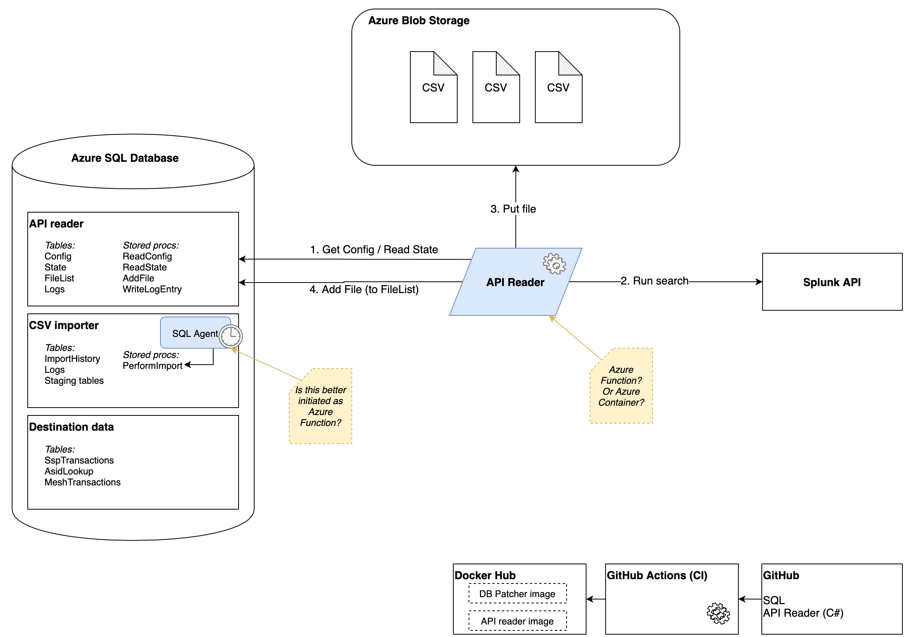

# GP Connect Analytics

## Build status

## Data import process

## Data extracts

1. ASID lookup data
2. SSP transactions
3. MESH send document transactions

## Splunk queries

### 1. Get the ASID lookup list

`| inputlookup asidLookup.csv`

### 2. Get SSP transactions

This query works on the Splunk Cloud only:

`index=spine2vfmmonitor (logReference=SSP0001 OR logReference=SSP0015 OR logReference=SSP0016) | transaction internalID maxspan=1h keepevicted=true | table _time, SspTraceId, sspFrom, sspTo, interaction, responseCode, duration, responseSize, responseErrorMessage, method | sort 0 _time
`

This query works on the Spine instance of Splunk only (i.e. Live A + Live B):

`index=spinevfmlog (logReference=SSP0001 OR logReference=SSP0004 OR logReference=SSP0012) | transaction internalID startswith=SSP0001 endswith=SSP0004 keepevicted=true maxspan=1h | table _time, sspFrom, sspTo, SspTraceId, interaction, responseCode, duration, responseSize, responseErrorMessage, method | sort 0 _time`

### 3. MESH send document transactions

(TBC)

## CSV filenames

General format:

`PROJECTNAME-EXTRACTNAME-QUERYFROMDATE-QUERYTODATE-SPLUNKINSTANCE-EXTRACTDATE.csv`

Where 
  - PROJECTNAME is `gpcanalytics`
  - EXTRACTNAME is `asidlookup`, `ssptrans` (MESH transactions TBC)
  - QUERYDATEFROM and QUERYDATETO is `YYYYMMDDTHHmmss`
  - SPLUNKINSTANCE is `cloud`, `spinea`, `spineb`
  - EXTRACTDATE is `YYYYMMDDTHHmmss`

Examples:

- `gpcanalytics-asidlookup-20200101T000000-20200101T000000-cloud-20210301T123200.csv`
- `gpcanalytics-ssptrans-20200101T000000-20200107T000000-cloud-20210105T103000.csv`
- `gpcanalytics-ssptrans-20200107T000000-2020014T000000-spinea-20210105T103000.csv`

Note:  The QUERYDATEFROM and QUERYDATETO don't affect the output of the ASID lookup data query from Splunk, however are included for consistency.

## Run a local SQL Server instance

To pull the image:

`docker pull mcr.microsoft.com/mssql/server`

To run the instance on the default port:

`docker run -e 'ACCEPT_EULA=Y' -e 'SA_PASSWORD=StrongP@ssword1' -p 1433:1433 -d mcr.microsoft.com/mssql/server`

